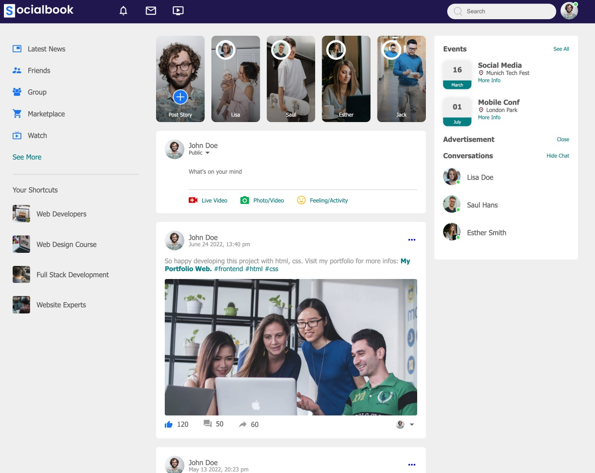

<!-- @format -->

# Social Web Frontend Clone

## Overview

This **Social App Clone** is a project designed to showcase my frontend development skills using HTML, CSS, and JavaScript. This project simulates a social media application and serves as a practical demonstration of my abilities in creating responsive web designs.

## Objectives

- To create a visually appealing and functional social media interface.
- To enhance my skills in HTML, CSS, and DOM manipulation.
- To implement responsive design techniques for mobile devices.

## Features

- **Two HTML Pages**:

  - **Home Page**: The landing page that loads by default or can be accessed by clicking the logo in the navbar.
  - **Profile Page**: Accessible via the dropdown menu by clicking the user icon in the navbar.

- **Light and Dark Mode Switch**: Users can toggle between light and dark themes for a better viewing experience based on their preference.

- **Responsive Design**: Utilizes CSS properties to adapt the layout for various devices, ensuring a smooth user experience across different screen sizes.

- **Dynamic Elements**: Includes a dropdown menu for user settings and notifications, enhancing interactivity.

## Challenges

One of the main challenges I faced during this project was implementing responsive design properties to ensure compatibility across various devices. This experience allowed me to deepen my understanding of CSS and improve my skills in creating adaptable layouts.

Additionally, I learned more about DOM manipulation while implementing the dropdown menu and other interactive elements.

## Technologies Used

- **HTML**: For structuring the content.
- **CSS**: For styling and layout.
- **JavaScript**: For interactivity and DOM manipulation.
- **Vite**: A build tool that provides a fast development environment.

## License

This project is licensed under the MIT License.

## Acknowledgments

Special mention for GreatStack, which offers tutorials and code examples to learn web development and frontend design.

Thank you for checking out my project! Feel free to provide feedback or suggestions for improvement.
